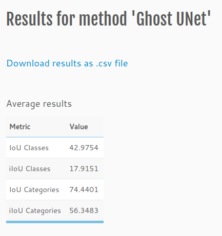
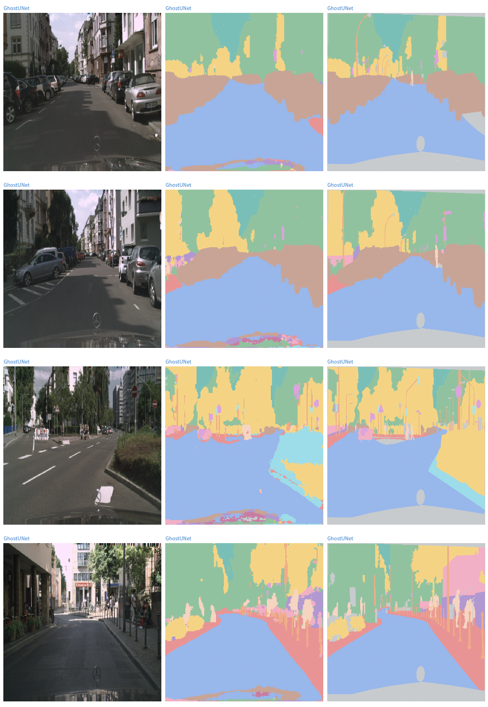
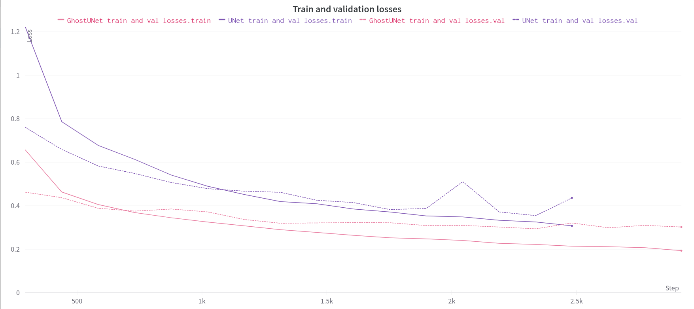

# Roads Segmentation

Implementation of two U-Net-based models for segmentation of RGB photos of roads trained on [Cityscapes](https://www.cityscapes-dataset.com/) dataset. Apart from baseline U-Net implementation, a lighter model based on Ghost U-Net that also achieves better results is included. 

Segmentation is performed on a single 512x512 RGB image. Ghost U-Net differs from the default U-Net architecture by usage of light convolution named Ghost modules, Squeeze-and-Excitation and Batch Norm layers.

Following technologies and tools were used:
* PyTorch
* PyTorch Lightning
* Weights and Biases
* Hydra
* venv
* AutoPep8, PyLint, pre-commit

Project made for Deep Neural Networks course (2022).

## Results

Better model (Ghost U-Net) achieved mIoU equal to **42.9754**, whereas baseline U-Net got only **24.7668**.



Here are some segmentations form that model (last image in row is ground-truth):



Model was trained for 20 epochs using Adam with batch size equal to 4 and learning rate 0.001.



## Quick start

Prepare virtual environment:

```console
$ python3 -m venv venv
$ source ./venv/bin/activate
```

Install required packages:

```console
(venv) $ pip install --upgrade pip
(venv) $ pip install -r requirements.txt
```

To register pre-commit hooks:

```console
(venv) $ pre-commit install
```

Run code formatter and/or linter:

```console
(venv) $ ./scripts/format_code.sh
(venv) $ ./scripts/run_linter.sh
```

## Usage

```console
(venv) $ python main.py
```

## References

M. Cordts, M. Omran, S. Ramos, T. Rehfeld, M. Enzweiler, R. Benenson, U. Franke, S. Roth, and B. Schiele, “The Cityscapes Dataset for Semantic Urban Scene Understanding,” in Proc. of the IEEE Conference on Computer Vision and Pattern Recognition (CVPR), 2016.

Olaf Ronneberger, Philipp Fischer, and Thomas Brox. U-net: Convolutional networks for​ biomedical image segmentation. Lecture Notes in Computer Science, page 234–241, 2015.

Iman Abaspur Kazerouni, Gerard Dooly, and Daniel Toal. Ghost-unet: An asymmetric encoder-decoder architecture for semantic segmentation from scratch. IEEE Access,​ 9:97457–97465, 2021.